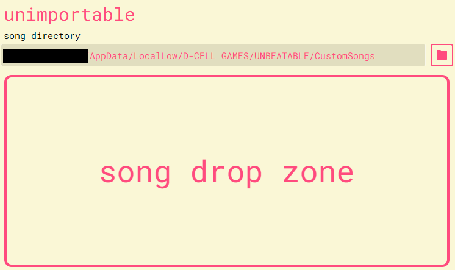

# song importer

A tiny app for importing custom songs into the rhythm game [UNBEATABLE](https://unbeatablegame.com).
Currently Windows only.

## Installation
- Download `UNBEATABLESongImporter.zip` from the
  [latest release](https://github.com/JustASideQuestNPC/UNBEATABLESongImporter/releases/latest).
- Unzip it anywhere.
- Run `UNBEATABLESongImporter.exe`.

## Usage
**Note:** It might take a long time to launch the first time. I have no idea why.

The first time you launch the song importer, it will try to detect the directory for custom songs.
Unless you've done some really weird things with your file system, it will probably be right. If
it's not, type a new path into the text box or click the folder icon to open a folder picker.

Custom songs should be a `.zip` file. To import one, either click on the song drop zone to open a
file picker, or just drag the file from File Explorer onto the drop zone.

If UNBEATABLE is currently running, the song won't appear until you back all the way out to the
story mode menu and reenter arcade mode. If you still don't see it, make sure you're looking for the
right difficulty, and that you have `-customsongs` in your Steam launch options.